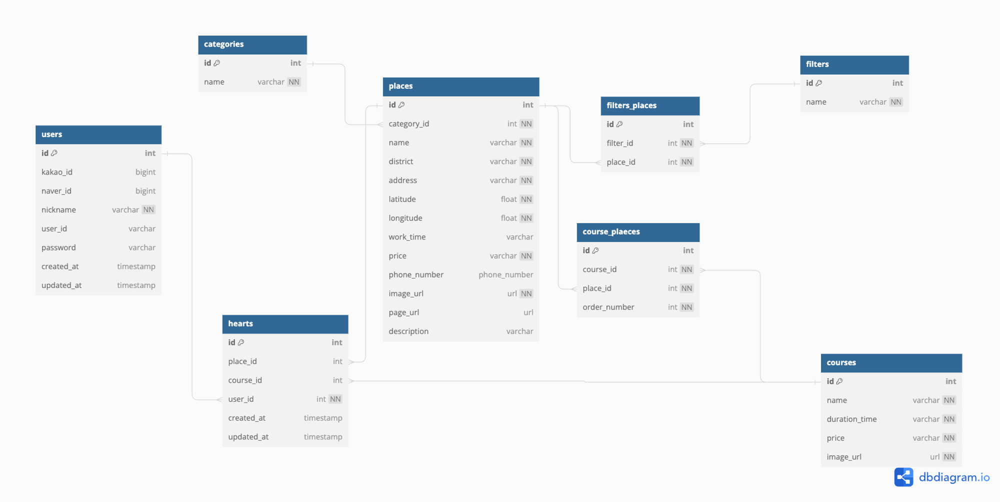

# PROJECT: We&Olufsen
## 소개
- 서울의 다양한 실외, 실내활동을 한눈에 보여주는 사이트
    - 다양한 활동 카테고리 제시
    - 위치 기반 가까운 장소 추천 기능
    - 사용자의 찜을 기반으로 맞춤 추천하는 ML 기능
        - UBCF, IBCF 알고리즘
    
- FE [Github](https://github.com/JJongsKim/Seoul-Walk)

## 팀 인원

## 개발 기간
- 개발 기간 : 2023-10-15 ~ 2023-12-06
- 협업 툴 : Github, Notion

## 기술 스택
|                                                Language                                                |                                                Framwork                                                |                                               Database                                               |                                                     ENV                                                      |                                                   HTTP                                                   |                                                  Deploy                                                 |
| :----------------------------------------------------------------------------------------------------: | :----------------------------------------------------------------------------------------------------: | :--------------------------------------------------------------------------------------------------: | :----------------------------------------------------------------------------------------------------------: | :------------------------------------------------------------------------------------------------------: |:------------------------------------------------------------------------------------------------------: |
|  |  |  |  |  |  
 
 
## 모델링

## 사이트 시연 영상

## API 명세서

* [서울산책 API](https://seoyun.oopy.io/c8bb95c7-558e-4ae4-966d-4353ad337e58)를 보시면, 자세한 API를 확인 가능합니다.